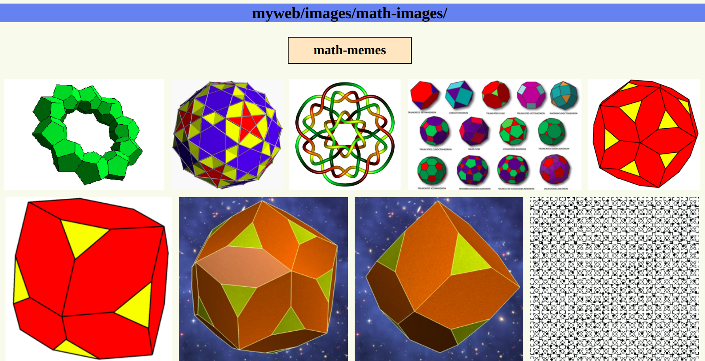

# IMGAL

A simple python script to generate a pleasing static html image gallery of the images in a given folder.

Can create an index recursively.

Can generate thumbnails or hotlink images.

Can include alt text (title text).

Multiple sorting options (modified, filename, filesize, compression, color, brightness, diagonal, aspect, etc.)

## Example



## Usage

```
Usage: imgal.py [OPTIONS]

Options:
  -p, --path TEXT
  -o, --output TEXT
  -s, --sort TEXT
  -z, --reverse-sort / --no-reverse-sort
  -g, --group / --no-group
  -w, --width INTEGER
  -m, --max-img-width INTEGER
  -n, --nav-bar / --no-nav-bar
  --nav-path TEXT
  -r, --recurse / --dont-recurse
  -t, --thumbnails / --no-thumbnails
  -c, --redo-thumbnails / --dont-redo-thumbnails
  --thumbnail-size INTEGER
  -d, --description / --no-description
  -h, --header TEXT
  --help                          Show this message and exit.

```

## Dependencies

## TODOs

- [ ] add button to copy image path to clipboard (with option to toggle?)
- [ ] find a way to fix color sorting
- [ ] find a way to sort by "cartoony-ness" or density of images
- [ ] implement a binning option with sorting 
- [ ] use setup tools to make system-wide command line tool
- [ ] clean up layout clock algorithm to be nicer at the bottom
  - [ ] idea 1: optimize more than one later at a time
  - [ ] idea 2: optimize globally, if possible

